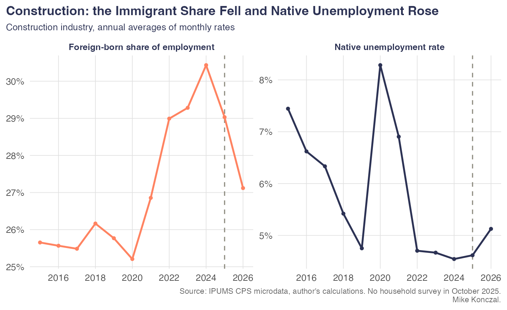
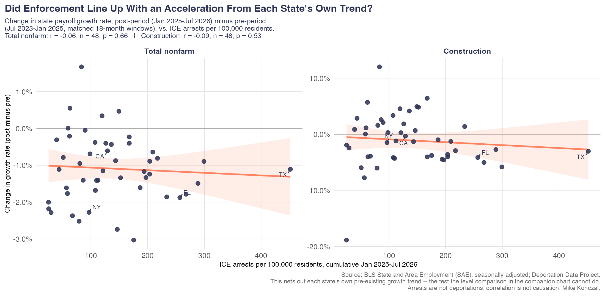

In response to my [recent post on women gaining 101% of jobs](https://newsletter.mikekonczal.com/p/why-are-women-over-100-of-jobs-gained) under the Trump administration, [many commentators argued](https://www.breitbart.com/economy/2026/09/10/breitbart-business-digest-liberals-are-worried-too-many-women-got-jobs-last-month/), that this was largely about immigration, about native-born male workers taking jobs formerly held by deported immigrants. As we will see, that's not true (see hypothesis TK below), native-born prime-age, male employment to population ratio is about the same or even below 2024 levels.

But it did make me realize that it's been a little bit since I took a dive into the immigration debates, and I'm braced to do this because I know the media and the Trump administration are not exactly "preponderance of the evidence" people. If they find one thing, one way to pitch the data, they'll run with it. Indeed, they spent a lot of 2025 arguing off the CPS raw levels, even though [Jed Kolko](https://jedkolko.substack.com/p/no-native-born-employment-has-not) spent a lot of time politely and ultimately correctly explaining why that was not a good idea. Like what are the chances we shoot the moon, and find a dozen different hypotheses that all turn out to go against the restrictionist's case?

Pretty good actually. I crank through 12 ways in which the mass deportations of the past year could have made things better for native-born workers in the labor market, and none of them came true. They are all null or in the other direction. That's pretty remarkable. A reminder that the unemployment rate right now (4.14%) is about where it was two years ago (4.19%), so we can't point to an obviously overall weaker macro environment to make this case. It's just that the story isn't coming true.

We're going to move pretty fast through this. There's a GitHub where you can go ahead and ask your AI to download it and check it yourself. Let's channel Jonathan Frakes telling us that none of these ever happened, they are all fiction, as we go through these.

[https://www.youtube.com/watch?v=GM-e46xdcUo]

**Hypothesis 1: Native-born unemployment would fall.**

It didn't happen. It's higher instead. (Not seasonally adjusted, aggregated published BLS categories.)

**Hypothesis 2: Prime-age employment would rise for native-born workers.**

It didn't happen. Instead, it is lower. (Not seasonally adjusted, aggregated published BLS categories.)

**Hypothesis 3: Prime-age employment would rise for native-born male workers.** During the 2024 election, in response to a question about deportations, J.D. Vance [said](https://reason.com/2024/10/17/j-d-vance-says-7-million-able-bodied-men-have-dropped-out-of-the-labor-force-where-are-they/), said "You would take, let's say for example, the seven million prime-age men who have dropped out of the labor force" and "re-engage folks into the American labor market." He later noted, "we have seven million—just men, not even women, just men—who have completely dropped out of the labor force." Did that work?

It didn't happen. Participation here is about the same or lower than 2024. (Not seasonally adjusted, author's IPUMS calculation.)

**Hypothesis 4: Least-educated native workers would do better.** There's some debate about this, but in theory, native-born workers without a high school diploma should have been competing the most with immigrant labor and thus should have the most to gain.

It didn't happen. Comparing January through August of each year, unemployment for native workers without a high school diploma rose from 8.8% in 2024 to 9.4% in 2026. That's the same 0.6-point rise college graduates saw. The group with the most to gain gained nothing relative to anyone else.

**Hypothesis 5: Wage growth would pick up for lower-income workers as deportations accelerated.**

It didn't happen. Real wages at the bottom of the income distribution fell. Here's the 10th percentile.

**Hypothesis 6: The highest-immigration-share job categories from my CES blog post should see the biggest wage increases.** This one uses no CPS microdata at all: I take the non-citizen worker share by industry from the 2024 ACS, apply the same crosswalk onto BLS's 249 CES industries as that post, split them into quintiles, and look at BLS's own published wage data by industry.

It didn't happen. The most non-citizen-intensive industries never show the fastest wage growth in any year, including 2026. There isn't a clean monotonic story here the way there was by occupation above — the middle of the distribution grew fastest in 2026 — but the top quintile, the one that theory says should have gained the most, at no point comes out on top.

**Hypothesis 7: Unemployed native workers could at least find work faster because immigrants were out of the way.**

It didn't happen. The monthly job-finding rate fell for native-born workers out here in 2026.

**Hypothesis 8: Immigration is behind the fall in the labor share, so mass deportations should push it back up.** This was actually a specific argument Baron Sargon brought up during the 2024 election.

It didn't happen. Labor share actually falls dramatically lower in 2025 and 2026, as we discussed in a recent post. It's falling so fast that people are genuinely unclear what is even going on.

**Hypothesis 9: Deportations would tighten the labor market. Job openings per unemployed worker and the quits rate should both rise.**

It didn't happen. Both measures fell from their 2022–23 highs and have stayed near those lows straight through 2025 and 2026. That's the opposite of what a labor-supply squeeze should produce.

**Hypothesis 10: Construction, in particular, should benefit — high foreign-born share, mostly male and non-college, and hard to offshore or automate.**

It didn't happen. The foreign-born share of construction employment did fall, from 30% in 2024 to 27% in 2026, exactly as the theory requires. But native-born unemployment in the industry rose over the same period, from 4.5% to 5.1% overall and from 5.9% to 6.7% among native-born men in the construction trades specifically — and the number of construction workers CPS is sampling fell too. That's a shrinking industry, not natives moving into vacated jobs. An industry-wide unemployment rate can't fully distinguish those two stories on its own, so the next test looks across states instead.

**Hypothesis 11: If the mechanism is real, it should show up in the cross-state pattern too — states with heavier ICE enforcement should see an acceleration in job growth, especially in construction.**

A raw level comparison here is contaminated: Texas and Florida have both a lot of enforcement and a lot of pre-existing growth for reasons that have nothing to do with 2025, so any positive correlation could just be "already-booming states get more enforcement," not an enforcement effect. The fix is to difference each state against its own trend — compare the post-enforcement growth rate (January 2025–July 2026) to the growth rate over the same-length window right before it (July 2023–January 2025), and correlate *that change* with enforcement intensity.

It didn't happen. Once you net out each state's own trend, the correlation isn't just insignificant — it flips slightly negative, for both total nonfarm employment (r = -0.06, p = 0.66) and construction specifically (r = -0.09, p = 0.53), and neither moves when Texas is dropped. States with heavier enforcement weren't accelerating relative to where they were already headed. *[Mike: you mentioned wanting to reference a specific chart/claim here — Steve Rattner? I couldn't find that citation anywhere in the repo, so I left it generic. Send me the link and I'll wire it in properly.]*

**Hypothesis 12: Run the same enforcement-intensity comparison against every state-level outcome available — native and foreign-born employment, wages, unemployment, across 23 different measures — and something should line up.**

It didn't happen. Wage growth here is already the trend-differenced version — each state's wage growth measured against its own prior-year trend, the same fix as Hypothesis 11 — rather than the raw level, because the level has the identical problem: high-enforcement states already had faster wage growth before the window started. Fixed that way, wage growth is unremarkable (r = 0.05, p = 0.74), and at the stricter p < 0.05 threshold across all 23 outcomes, exactly one is statistically significant: states' 2024 construction employment share predicts ICE enforcement intensity better than anything downstream of enforcement does. That's not a finding about what enforcement did — it's evidence that enforcement wasn't handed out at random across state economies in the first place. The two next-closest rows sit just outside the line and don't help the restrictionist case either: heavier-enforcement states saw unemployment rise more (r = 0.28, p = 0.05), and their raw payroll growth ran slightly faster (r = 0.27, p = 0.06), which is the level comparison Hypothesis 11 already showed disappears once you net out each state's own trend.

Nothing here is as cleanly instrumented as the occupation-level and industry-level tests above — this is closer to real-time, kick-the-tires analysis than a single well-designed test. But that's what makes it useful: run enough looks and a few should land in the restrictionists' favor by chance alone. They don't. The case was never especially well thought out to begin with.
