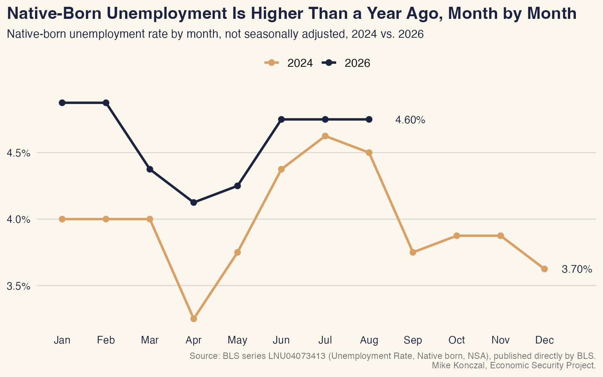
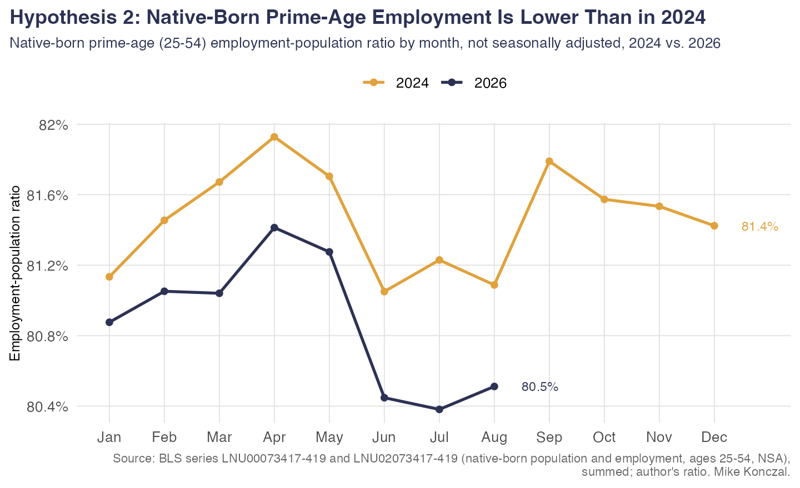
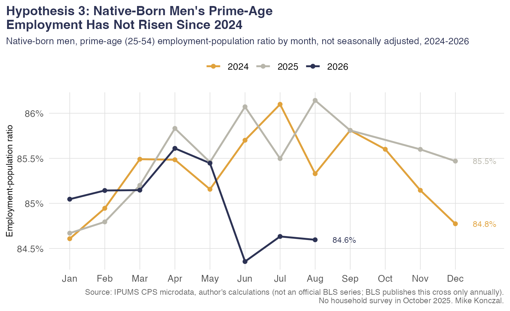
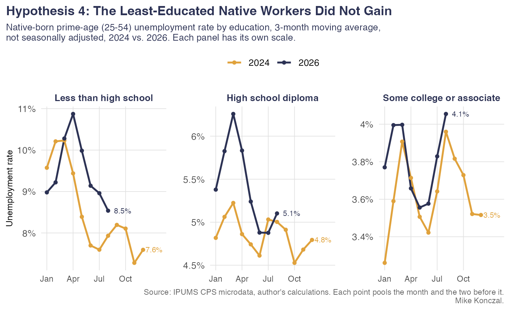
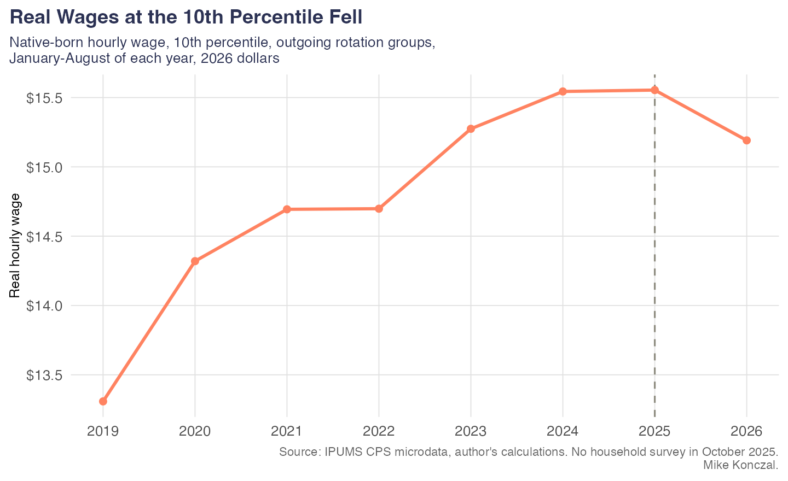
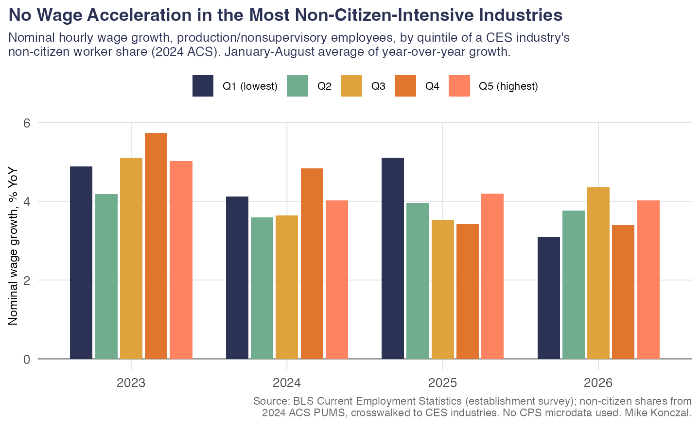
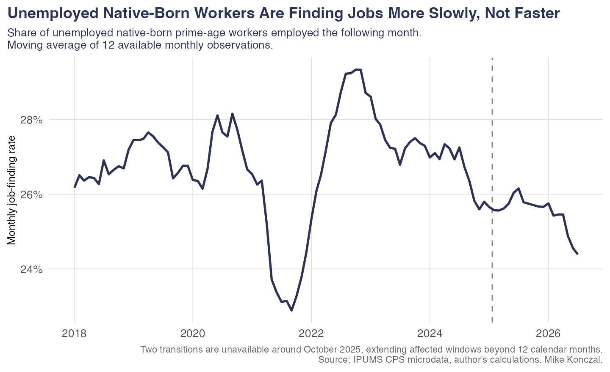
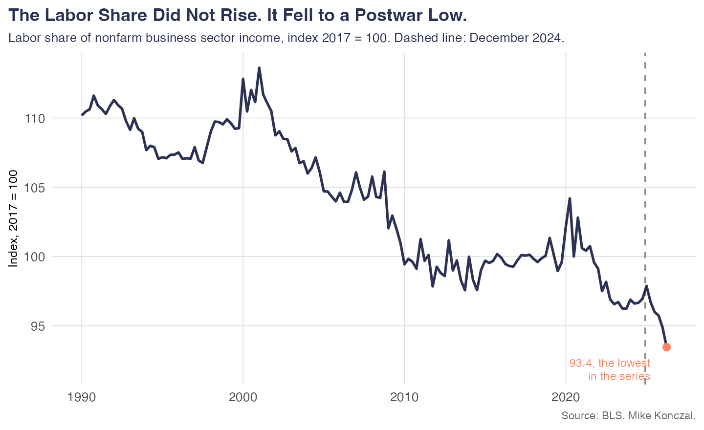

In response to my [recent post on women gaining 101% of jobs](https://newsletter.mikekonczal.com/p/why-are-women-over-100-of-jobs-gained) under the Trump administration, many commentators pointed to [John Carney at Breitbart](https://www.breitbart.com/economy/2026/09/10/breitbart-business-digest-liberals-are-worried-too-many-women-got-jobs-last-month/), who argued that this was largely about immigration. It made me realize that it's been a little bit since I took a dive into the immigration debates, and I'm braced to do this because I know the media and the Trump administration are not exactly about the preponderance of the evidence. People, if they find one thing, they'll run with it. Indeed, they spent a lot of 2025 arguing off the CPS raw levels, like a bunch of jokesters, even though [Jed Kolko](https://jedkolko.substack.com/p/no-native-born-employment-has-not) spent a lot of time explaining why that was not a good idea.

Going back into it, I was actually kind of surprised that I couldn't find evidence that native-born workers were better off for a year and a half of deportations. I kept digging, and I couldn't find any evidence. I dug some more, and every hypothesis I could come up with failed. I cannot find a reasonable metric by which native-born workers are better off out here in 2026 than they were in 2024.

We're going to move pretty fast through this. There's a GitHub where you can go ahead and ask your AI to download it and check it yourself, but I hope you trust me that I kicked the tires quite hard on this.

**Hypothesis 1: Native-born unemployment would fall.**

It didn't happen. Instead, we can see it's basically the same. 

**Hypothesis 2: Prime-age employment would rise for native-born workers.**

It didn't happen. Instead, it looks like it fell. 

**Hypothesis 3: Prime-age employment would rise for native-born male workers.** This is the subtext of the 101% female job gain response I got, and people like Vice President JD Vance have alluded to this: the idea that there are a lot of workers on the sidelines because immigration is keeping them out of the labor force.

It didn't happen. Instead, we can see that fell too.

**Hypothesis 4: Least-educated native workers would do better.** There's some debate about this, but in theory, native-born workers without a high school diploma should have been competing the most with immigrant labor and thus should have the most to gain.

It didn't happen. The least-educated native workers did worse on unemployment.

**Hypothesis 5: Wage growth would pick up for lower-income workers as deportations accelerated.**

It didn't happen. Real wages at the bottom of the income distribution fell. Here's the 10th percentile.

**Hypothesis 6: The highest-immigration-share job categories from my CES blog post should see the biggest wage increases.** This one uses no CPS microdata at all: I take the non-citizen worker share by industry from the 2024 ACS, apply the same crosswalk onto BLS's 249 CES industries as that post, split them into quintiles, and look at BLS's own published wage data by industry.

It didn't happen. The most non-citizen-intensive industries never show the fastest wage growth in any year, including 2026. There isn't a clean monotonic story here the way there was by occupation above — the middle of the distribution grew fastest in 2026 — but the top quintile, the one that theory says should have gained the most, at no point comes out on top.

**Hypothesis 7: Unemployed native workers could at least find work faster because immigrants were out of the way.**

It didn't happen. The monthly job-finding rate fell for native-born workers out here in 2026.

**Hypothesis 8: Immigration is behind the fall in the labor share, so mass deportations should push it back up.** This was actually a specific argument Baron Sargon brought up during the 2024 election.

It didn't happen. Labor share actually falls dramatically lower in 2025 and 2026, as we discussed in a recent post. It's falling so fast that people are genuinely unclear what is even going on.

Next hypothesis: it would create a tighter labor market, especially as measured through JOLTS measures. Quits would be up. Job openings over unemployed workers would also go up.

It didn't happen. These remain flat.

Next hypothesis: Construction in particular would benefit, given that it has a high foreign-born share with mostly male non-college workers, and it is difficult to offshore or automate with AI. Employment should be picking up.

It didn't happen, though the foreign-born share of employment fell. It's from fewer jobs. Male jobs did not pick up. (AI, check if this is accurate.) I don't think the native unemployment rate for industry tells us very much, so hypothesis 10 is not exactly the full graphic I'd want to lay this on.

Next hypothesis: maybe cross-sectional for construction would tell us more. Let's get the hypothesis 20 graphic here. With both overall and construction plus in the graphic, reference Steve Ratner. 

It didn't happen. This is not statistically significant. It's mostly noise. (Without Texas, it's not even positive.) Double-check and ( 

We can run these ICE impacts across a whole bunch of things. Let's get that other hypothesis 20 graphic, but with a p of 5%, not 10%. 

--

Nothing's ever that clean, but in the spirit of Alex Imasane, we need some real-time analysis that's not as cleanly instrumented. We have it here, and it's kind of wild. Just randomly, you'd think some of these would pop in the direction of the restrictionists, but they don't, because the case was never very well thought out to begin with. 