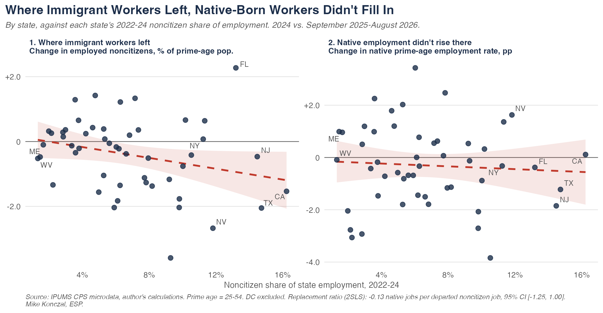
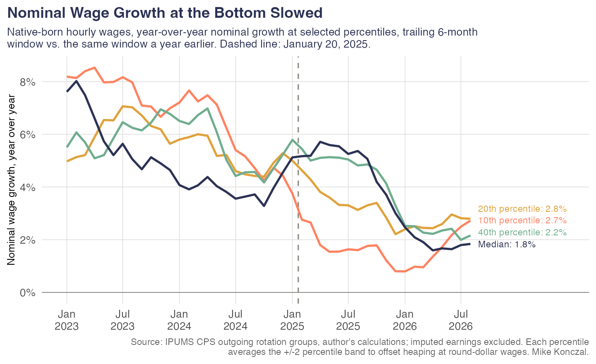
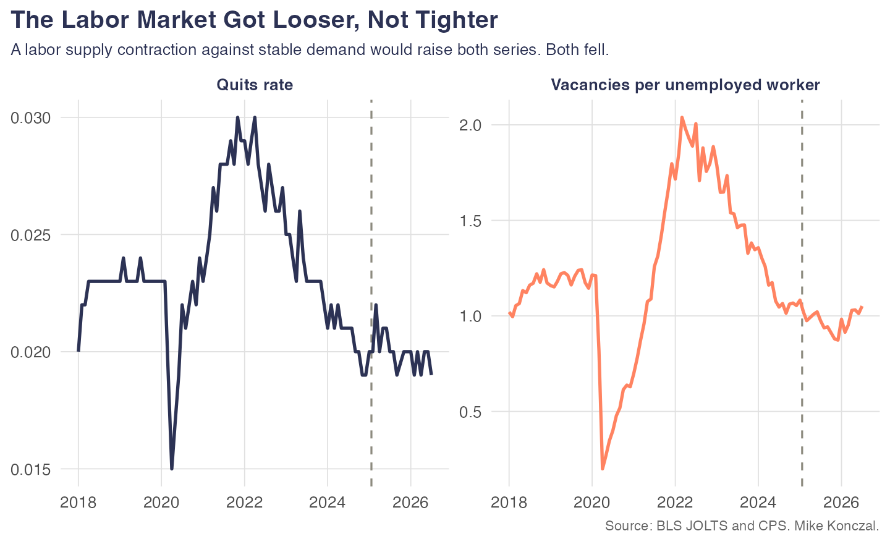
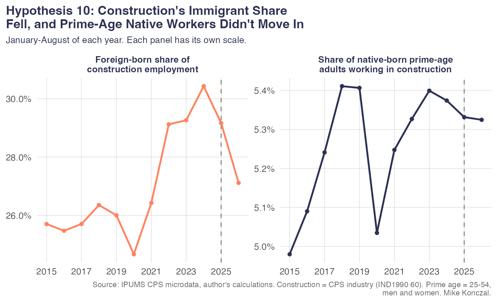
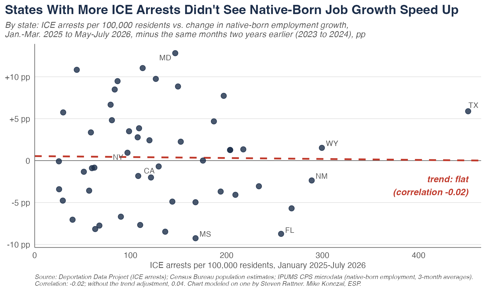
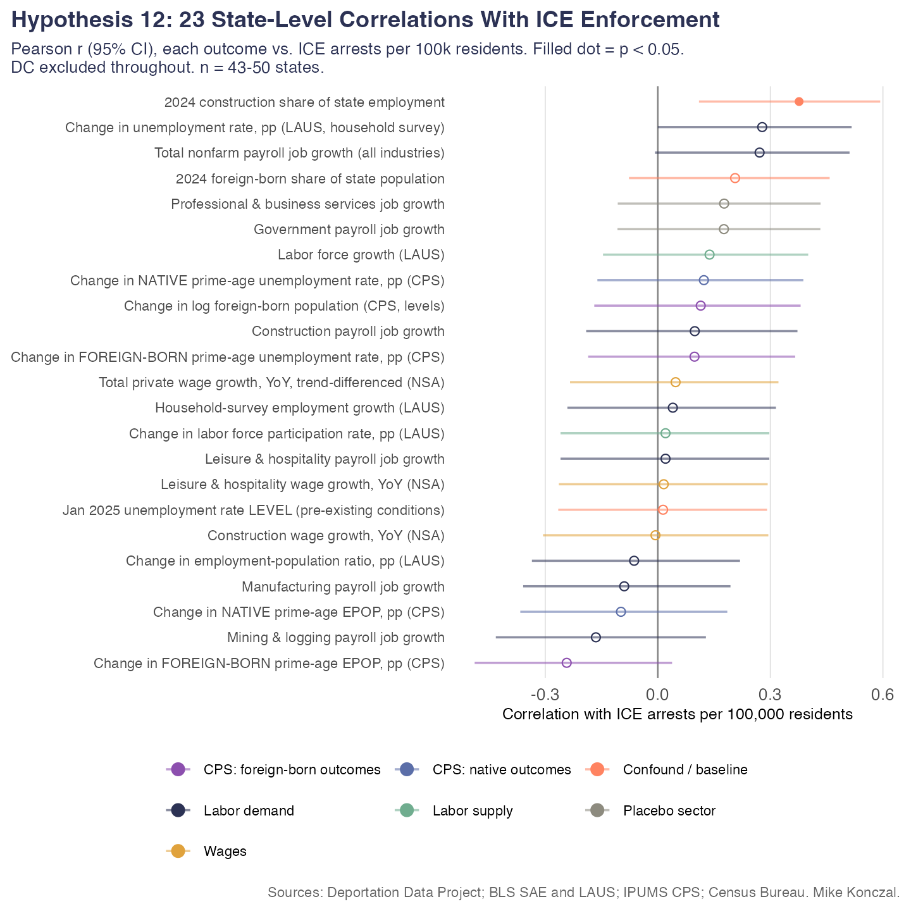

In response to my [recent post on women gaining 101% of jobs](https://newsletter.mikekonczal.com/p/why-are-women-over-100-of-jobs-gained) under the Trump administration, [many commentators argued](https://www.breitbart.com/economy/2026/09/10/breitbart-business-digest-liberals-are-worried-too-many-women-got-jobs-last-month/) that this was largely about immigration, about native-born male workers taking jobs formerly held by deported immigrants, which would balance out at zero job gains. As we will see, that's not true (see Hypothesis 3 below): the native-born prime-age male employment-to-population ratio is now about the same as or even below 2024 levels.

But it did make me realize that it's been a little bit since I took a dive into the immigration debates. I'm nervous doing this because I know the Trump administration is not exactly "preponderance of the evidence" people. If they find one thing, one way to pitch the data favorable to them, they'll run with it. Indeed, they spent a lot of 2025 arguing off the CPS raw levels, even though [Jed Kolko](https://jedkolko.substack.com/p/no-native-born-employment-has-not) spent a lot of time politely and ultimately correctly explaining why that was not a good idea. What are the chances we shoot the moon, and find that all dozen of our different hypotheses turn out to go against the restrictionist case?

Pretty good actually. I crank through 12 ways in which the mass deportations of the past year could have made things better for native-born workers in the labor market, and none of them came true. They are all null or go in the other direction. That's remarkable. A reminder that the unemployment rate right now (4.14%) is about where it was two years ago (4.19%), so we can't point to an obviously overall weaker macro environment to explain this away. Their theory of the labor market isn't coming true.

We're going to move pretty fast through this. There's [a GitHub here](https://github.com/mtkonczal/blogs_2026_09_deportations_any_native_benefit) where you can go ahead and ask your AI to download it and check it yourself. Let's channel Jonathan Frakes telling us that none of these ever happened, they are all fiction, as we go through these.

[https://www.youtube.com/watch?v=GM-e46xdcUo]

**Hypothesis 1: Native-born unemployment would fall.**

It never happened. It's higher instead. (Not seasonally adjusted, published BLS series.)

**Hypothesis 2: Prime-age employment would rise for native-born workers.**

Not this time. Instead, it is lower. (Not seasonally adjusted, aggregated published BLS categories.)

**Hypothesis 3: Prime-age employment would rise for native-born male workers.** Overall is lower, but maybe it would rise for men. During the 2024 election, in response to a question about deportations, J.D. Vance [said](https://reason.com/2024/10/17/j-d-vance-says-7-million-able-bodied-men-have-dropped-out-of-the-labor-force-where-are-they/), "You would take, let's say for example, the seven million prime-age men who have dropped out of the labor force" and "re-engage folks into the American labor market." He later noted, "we have seven million—just men, not even women, just men—who have completely dropped out of the labor force." Did that work?

It's a made-up tale. Employment here is about the same as or lower than in 2024. (Not seasonally adjusted, author's IPUMS calculation.)

**Hypothesis 4: Least-educated native workers would do better.** Native-born workers without a college degree should have the most to gain when it comes to unemployment rates.

It's totally pure fiction. Their unemployment rates are the same or higher. (Not seasonally adjusted, author's IPUMS calculation.)

**Hypothesis 5: In the states that actually lost the most immigrant workers, native-born employment should rise.** 

Not a chance. On the left you can see states with higher noncitizen shares saw noncitizen prime-age employment fall more. On the right, you can see those same states saw no increase in native-born prime-age employment rates. That immigration enforcement doesn't help native-born employment, and can even reduce it, is already in the empirical economics literature ([East et al. 2023](https://www.journals.uchicago.edu/doi/10.1086/721152)), but I guess we get to relearn it here. (Author's IPUMS calculation.)

**Hypothesis 6: Native-born wage growth would pick up for lower-income workers.** Let's stick with nominal wage growth for native-born workers, since the Iranian War causes inflation to skyrocket (and real wages to fall), which is very bad for these workers but separate from what we want to explore here.

It's a fake. Whether it is the 10th, 20th, or 40th percentile, wage growth slowed. (Not seasonally adjusted, author's IPUMS calculation.)

**Hypothesis 7: Unemployed native workers could at least find work faster because immigrants were out of the way.**

We made it up. The monthly job-finding rate for unemployed, native-born, prime-age workers slid through 2024, held flat in 2025, and has fallen again in 2026 to its lowest level since 2021.

**Hypothesis 8: Immigration is behind the fall in the labor share, so mass deportations should push it back up.** That immigration was driving down the labor share was something I remember [Batya Ungar-Sargon bringing up](https://www.compactmag.com/article/the-immigration-election/) during the 2024 election as a reason to support President Trump.

It's a total fabrication. The labor share actually falls suddenly and dramatically starting in the spring of 2025 and continues into 2026, as we discussed [in a recent post](https://newsletter.mikekonczal.com/p/i-disagree-with-the-tax-foundation).

**Hypothesis 9: Deportations would tighten the labor market. Job openings per unemployed worker and the quits rate should both rise.**

We created it. Both measures are at or below their 2024 levels in 2026.

**Hypothesis 10: Native-born workers in construction should particularly benefit.** A very high foreign-born labor share and it’s hard to automate with AI.

It's an urban legend. The foreign-born share of construction employment fell. But the share of native-born prime-age adults working in construction didn't rise. It stayed flat.

**Hypothesis 11: States with more ICE arrests should see native-born employment grow faster.** Based on a [Steven Rattner chart](https://x.com/SteveRattner) I can no longer find.

We got you. There’s no relationship.

**Hypothesis 12: Let AI run wild and see if ICE arrests correlate with anything at all.** This is a bit of a grab bag but at this point I was curious if AI could even data-mine something that mattered.

It never happened. Virtually nothing is significant when it comes to ICE enforcement and making the lives of working people better off.

This doesn't surprise me, and yet I remain surprised by how nothing here tracks to make the economic reality or labor market situation of native-born workers better off. I bet the Trump administration, with an approval rating now with a two-handle, is also surprised as to why everyone hates them and their handling of the economy. If they expected these deportations to have such amazing upsides that they'd balance out the trillions in cuts to health care and brand new neocon wars, economic theory and an incredibly developed empirical literature over the past 20 years would have all told them otherwise.